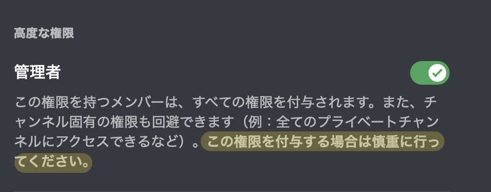

# Bot 製作ガイドライン 2023

これは 2020 年に制作された **限界開発鯖 BOT 制作ガイドライン** を最新の Discord API のアップデートを反映し、再構成したガイドラインです。

---

限界開発鯖は **鯖民の自由、自主性を最重要視** しています。

この Bot 製作ガイドラインに書かれているルールさえ守られていればどんな Bot でも導入ができます。

Bot 製作時は必ずこのガイドラインを守るようにしてください。

## Bot を作成する際のルール

限界開発鯖に Bot を導入する際は以下のルールに従う必要があります。

1. Bot は[管理者権限](#管理者権限とは)を付与してはいけない
2. Bot の機能に必要な権限以外を付与してはいけない
3. 他の Bot のメッセージに反応してはいけない
4. [言論統制](#言論統制とは)はしてはいけない
5. GitHub, GitLab 等のサービスにソースコードをアップロードする際にトークンが記載されてはいけない
6. トークンを外部に漏洩させてはいけない

これらのルールに従えない場合は、Bot の権限剥奪、最悪の場合あなた自身の権限も剥奪する可能性があることを覚えておいてください。

### 管理者権限とは

Discord にはサーバー(ギルド)を制御するために権限システムというものが存在します。その中でも特にヤバい権限で **Administer**(管理者権限) というものがあります。

これは **ほぼすべての権限を網羅し、コードの処理次第ではコミュニティ全体を破壊する** 危険な権限です。

Discord ではクライアント上でも **この権限を付与する際は慎重に行ってください。** と忠告しています。Bot にはこの権限を付与しないでください。



### 言論統制とは

言論統制とは以下の行為を指します。

1. 内容によってメッセージを自動で削除、編集しようとすること
2. 誘導によって、メッセージの内容を操作しようとすること

## Bot 作成のためのフローチャート

#### 1. Discord Developer Portal でアプリケーションを作成する

1. [Applications](https://discord.com/developers/applications) にアクセスする
   - ログインを迫られたら、素直に応じる
2. `New Application` をクリックする
3. アプリ名を決め、各規約に同意し `Create`

#### 2. Bot を作成する

1. `Bot` タブへ移動
2. `New Bot` をクリックする
3. `Privileged Gateway Intents` にある Intent を全てチェックマークボタンから有効化する

#### 3. トークンを保存する

1. `Reset Token` をクリックする
2. 2FA の設定をしている場合はワンタイムパスワードを求められるので入力する
3. トークンが発行されるのでコピーし、 **大切な場所に保存する**

#### 4. 招待リンクを発行

1. `OAuth2` タブ -> `URL Generator` をクリック
2. Scopes から `bot` を選ぶ

> アプリケーションコマンド登録に必要だった `bot.commands` は 2022/07/14 以降必要なくなりました。

3. 権限を選択する
   - ここで絶対に **管理者権限** は付与しないこと！

権限の詳細はドキュメントが一番詳しいです。迷ったらチェックしてみてください。

[Permissions - Discord Developer Docs](https://discord.com/developers/docs/topics/permissions)

#### 5. Bot の招待

生成された URL をクリックすると招待画面になるのでここで **限界開発鯖** を選び、 **認証** をクリックし招待します。

これで Bot の作成、招待は終了です。

## テンプレート

ここに書いてあるテンプレートを元に Bot を作成すれば上のルールを大体守れます。

が、同然あなたも気をつける必要がある点が多少あります。

### TypeScript / JavaScript

```ts copy
import { Client, GatewayIntentBits, Message } from 'discord.js';

const client = new Client({
  intents: [
    GatewayIntentBits.Guilds,
    GatewayIntentBits.GuildMessages,
    GatewayIntentBits.MessageContent
  ]
});

client.on('ready', () => {
  // ここに起動したときの処理
  console.log('準備完了');
});

client.on('message', async (msg: Message) => {
  if (msg.author.bot) {
    return;
  }
  // ここにメッセージを受信したときの処理
});

client.login(process.env.DISCORD_TOKEN);
```

### Python

```py copy
import discord

intents = discord.Intents.default()
intents.message_content = True

client = discord.Client(intents=intents)

@client.event
async def on_ready():
    print(f'We have logged in as {client.user}')

@client.event
async def on_message(message):
    if message.author.bot:
        return

    // ここにメッセージを受信したときの処理

client.run('your token here')
```
